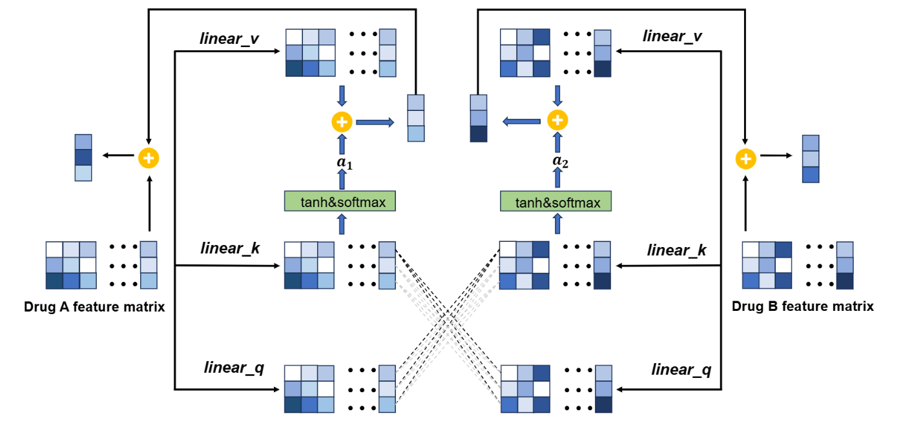

## ADGSyn

**ADGSyn: Dual-Stream Learning for Efficient Anticancer Drug Synergy Prediction** 





### Requirements

```
python        3.11.5
pytorch       2.3.1
numpy         1.25.2
scikit-learn  1.3.0
```


### How to Start

Locate the `Data.md` file within the `data` directory to retrieve the data. Then, execute the `main.py` script in the `src` directory to proceed.

```python
python main.py 
```

